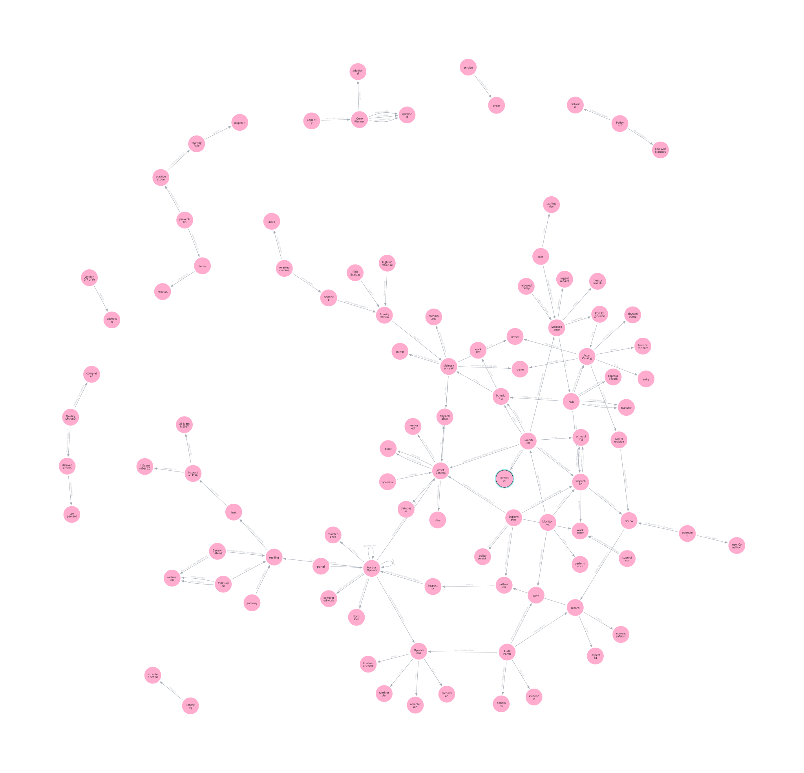

# Semantic Fact Graph

An experimental, schema-constrained fact-graph extraction pipeline using Kimi K2.6, deterministic technical enrichment, typed graph validation, JSON authority, and Neo4j parity verification.

## Project status

> **Status: Experimental Release Candidate**
>
> This repository is intended for local evaluation and controlled single-user deployments. It is not yet recommended for unattended production or shared-database use.

The suggested first public tag is `v0.1.0-rc1`. Semantic extraction remains probabilistic even when the structural pipeline is deterministic for a fixed accepted extraction.

The project is a research prototype for using evidence-backed fact graphs as
an intermediate representation in deeper document-analysis and comparison
workflows. A downstream agent can query this representation to select,
contrast, and trace claims before producing such outputs as summaries or
context-compressed working sets. The repository does not itself establish a
production-ready summarization or compression system: those applications
require task-specific evaluation of information retention, contradiction
handling, evidence coverage, latency, and cost. The included model, prompt, and
threshold configuration is a reproducible demonstration rather than an
optimized recommendation for those workloads.

## What the project does

The pipeline turns formal-document text into an observable, typed JSON fact graph. It retains evidence-span references for provenance, validates structural contracts, resolves entities through recorded similarity decisions, and can build an exact derived Neo4j projection.

## Key capabilities

- deterministic paragraph/unit and sentence/evidence-span splitting;
- one schema-constrained fact-extraction call per deterministic evidence span;
- Pydantic and evidence validation without semantic repair;
- `bge-m3` embeddings over canonical entity names;
- observable pairwise entity resolution and deterministic consolidation;
- deterministic entity IDs for a fixed extraction ordering, content-derived edge IDs, qualifier rebinding, and durable terminal-outcome accounting;
- typed final-graph validation before persistence;
- exact JSON/Neo4j data, property, schema, index, and namespace parity.

## Architecture

JSON is the authoritative graph representation. Neo4j is a rebuildable, graph-scoped projection rather than a semantic editing or recovery authority. See [the architecture guide](docs/ARCHITECTURE.md) for component boundaries and completion gates.

## Pipeline stages

`source -> deterministic evidence spans -> configured model + prompt_kimi_default -> schema/evidence/temporal validation -> bge-m3 -> observable entity resolution -> exact consolidation -> fact_graph.json -> Neo4j`

`scripts/run_production.py` is the supported CLI and delegates to `runtime.production_runner`. A candidate graph must satisfy `runtime.final_graph_contract.FinalGraph` before `fact_graph.json` is persisted or Neo4j is called. JSON is authoritative. Neo4j is rebuilt from JSON and is never a recovery store.

Exactly one successful primary extraction call is permitted per unit. Post-extraction semantic LLM calls, merge verifiers, fact-layer calls, gleaning, and semantic patches remain zero. HTTP attempts, failures, timeouts, and accepted extractions are counted separately.

Every primary attempt ends in exactly one recorded terminal category:
`transport_failed`, `provider_response_rejected`, `tool_contract_failed`,
`schema_failed`, `evidence_failed`, or `accepted`. An unusable HTTP-200 response
is never counted as an accepted extraction.

## Requirements

- Python 3.11+
- an OpenAI-compatible chat-completions endpoint with native tool calls;
- a compatible embeddings endpoint exposing configured model `bge-m3`;
- Neo4j 5.x for projection (Docker Compose example included).

The selected extraction profile is `kimi_k2_6_vllm_structured` for model
`kimi-2.6`; the general-purpose `kimi_k2_6_vllm_instant` profile remains
available with its original sampling defaults. The structured profile uses
`temperature=0`, omits `top_p`, uses `tool_choice=auto`, and forwards
`chat_template_kwargs.thinking=false` plus `preserve_thinking=false` to an
unmodified Kimi K2.6 chat template. The endpoint must still return exactly one
native tool call with the correct name and schema/evidence-valid arguments.
Profile configuration cannot compensate for a serving endpoint that lacks the
Kimi tool parser.

## Installation

```powershell
python -m venv .venv
.\.venv\Scripts\Activate.ps1
python -m pip install -c constraints.txt -e .
python -m pip install -c constraints.txt -e ".[test]"
python -m pip install -c constraints.txt -e ".[docs]"
python -m pip install -c constraints.txt -e ".[dev]"
```

Use the base command for runtime-only use and `test` or `dev` for offline
validation. The tested exact versions are recorded in `constraints.txt`;
compatible bounds remain in `pyproject.toml`. Development and release tools
live under `devtools/` and are intentionally excluded from the production
package.

## Configuration

Non-secret settings are defined in `config/*.yaml`. Strict typed loading rejects unknown contract, provider, request-extension, and runtime fields before external transport. See [Provider configuration](docs/CONFIGURATION.md).

## Environment variables

Set the environment variables named in `config/runtime.yaml` and `config/neo4j.yaml`:

```powershell
$env:SEMANTIC_GRAPH_LLM_BASE_URL = "https://your-endpoint/v1"
$env:SEMANTIC_GRAPH_EMBEDDING_BASE_URL = "https://your-endpoint/v1"
$env:OPENAI_API_KEY = "<secret>"
```

For Neo4j, copy `.env.neo4j.example` to ignored `.env.neo4j`, set its password, and start:

```powershell
docker compose --env-file .env.neo4j -f docker-compose.neo4j.yml up -d
```

Active non-secret YAML:

- `config/extraction.yaml`: contract/prompt pair, deterministic contract
  checks, splitting, and schema/request bounds;
- `config/entity_resolution.yaml`: embedding, retrieval, thresholds, decisions;
- `config/runtime.yaml`: endpoint variable names, provider profiles, capability-probe bounds, request overrides, and timeouts;
- `config/neo4j.yaml`: database environment names and `graph_id` namespace.

Strict settings reject unknown contract/prompt pairs, provider profiles,
fields, and unsupported modes before transport. Profiles own model ID, the
native-tool structured-output transport, tool choice, sampling, timeout, and reasoning policy.
Provider extras and run-level overrides are restricted to the validated Kimi
`chat_template_kwargs.thinking` and `preserve_thinking` extension boundary.

## Prompt registry

The active production contract is:

```yaml
extraction:
  granularity: evidence_span
  contract_id: evidence_span_fact_extraction
  prompt_id: prompt_kimi_default
  max_concurrency: 4
  failure_policy: finish_in_flight_then_fail
```

`config/extraction.yaml` owns the semantic prompt, contract, and schema IDs.
`resolve_prompt(prompt_id)` resolves only the configured prompt asset and its
typed adapter; unsupported prompt IDs fail before transport. The configured
`fact_extraction_schema` uses compact zero-based entity/relation
indices, top-level temporal bindings, and deterministic technical enrichment.
Each request receives exactly one existing evidence span, and validated results
are aggregated in source order before resolution and graph construction.

## Supported endpoint contract

The endpoint must accept configured OpenAI-compatible chat-completion payloads, honor forced native tool calling or the documented equivalent, return one schema-valid argument object, and expose truthful usage/finish data when available. Model-specific request overrides belong in YAML. Protocol similarity alone does not imply verified compatibility.

For self-hosted Kimi K2.6 on vLLM/SGLang, instant mode uses
`chat_template_kwargs: {thinking: false, preserve_thinking: false}` and requires
server-side auto tool choice with the `kimi_k2` tool and reasoning parsers.
`tool_choice=auto` is a Kimi profile value, not a global production rule.

## Running extraction

```powershell
python -m scripts.run_production --input examples/sample_input.txt --output outputs/example_run
```

The output directory must be new. Resume is not supported; after an incomplete run, choose a new output directory or explicitly remove the incomplete directory after retaining any diagnostic artifacts you need.

Input files may be inside or outside the repository. Public graph metadata stores
only the source filename, UTF-8 content hash and size, location policy, and an
optional repository-relative path; it never stores an absolute local path.
`--run-id` accepts 1-64 safe characters. When omitted with `--output`, a UUID-based
run ID is generated. `graph_id` binds that run ID to source, prompt, schema,
contract, and provider-profile identity, so output-directory basenames are not
Neo4j namespaces.

A production graph is final when extraction, schema/evidence validation,
resolution, consolidation, typed FinalGraph persistence, configured Neo4j
projection, and structural parity complete. Production never invokes the public
golden checker and requires no later graph editing or evaluation command.

## Viewing the generated graph

Open the most recently completed successful run:

```powershell
python -m scripts.open_graph --latest --open
```

Or select a run explicitly:

```powershell
python -m scripts.open_graph --run-id public_relation_coverage_final --open
```

Before opening Browser, the command connects to the configured Neo4j database and
verifies that the selected `graph_id` has nodes, relationships, and paths under the
exact viewer query. Use `--show-query` to print the decoded Cypher alongside these
preflight counts, or `--print-only` to validate and print the URL without launching
Browser.

Production can open the graph only after successful Neo4j projection and JSON/Neo4j parity:

```powershell
python -m scripts.run_production `
  --input examples/sample_input.txt `
  --run-id example `
  --open-graph
```

The command opens Neo4j Browser with a prepared query restricted to that graph's
`graph_id`. Browser connection/authentication state is independent from the CLI
preflight: sign in to the configured instance if prompted, run `:clear`, select the
configured database with `:use neo4j` (or the database printed by the command), then
press Run or `Ctrl+Enter`. A disconnected Browser session can show no records even
when preflight succeeds. Use `--graph-id` to select a namespace directly and
`--limit` to change the default 500-relationship view bound.

Relationships are stored as `FACT_RELATION`. Neo4j Browser displays the
`raw_relation` property as the default relationship caption, preserving the
relation wording produced during extraction. Browser stylesheet state is local to
the Browser session, so run `:style` and upload `config/neo4j_browser.grass` once.
The viewer CLI prints this instruction after a successful preflight and does not
claim that Browser-local style state was applied automatically.

## Output artifacts

Primary files include:

- `resolved_run_config.json`: redacted active/static configuration;
- `prompt_manifest.json`: prompt family, version, ID, and content hash;
- `run_manifest.json`: safe source identity, run ID, graph ID, and manifest identity hash;
- `projection_manifest.json`: graph ID and validated Neo4j structural label/type names;
- `fact_graph.json`: authoritative graph;
- `completion_status.json`: completed extraction, FinalGraph, projection, and parity statuses;
- `validation_report.json` and `run_report.json`;
- `model_call_attempts.json` and `model_call_budget.json`;
- `json_neo4j_edge_diff.json`: data, property, schema, index, and namespace parity;
- `graph_view.json`: secret-free Browser URL, graph-scoped query, counts, and completion metadata;
- unit spans, local entities/relations, raw request/response evidence, parsed arguments, embedding metadata, similarity matrix/candidates, resolution mapping, and global entities.

Raw requests, sanitized provider response bodies, and `source.txt` can contain
confidential document content. They are always ignored by Git, but remain local
data-at-rest; apply an explicit retention/access policy and do not publish run
directories. Authorization headers and reasoning fields are not persisted.

## Example graph

### Neo4j Browser projection example

The project projects validated `fact_graph.json` data into Neo4j. The documented
example uses the existing Neo4j projection and namespace-filtered Browser query,
not a separate visualization implementation. The checked-in SVG is a reviewed
static export of a parity-passing projection, not an independently reconstructed
graph.

See [the Neo4j graph example](docs/example-graph.md) for the reviewed source,
exact read-only Cypher, graph namespace, captions, and refresh workflow.

### Current visualization

The displayed example processes [`examples/sample_input.txt`](examples/sample_input.txt)
with the demonstration configuration. It uses one extraction call per evidence
span and zero post-extraction semantic calls. The resulting authoritative graph
contains 103 nodes and 117 edges and has exact JSON/Neo4j parity.



LLM extraction is probabilistic. Repeated processing of the same text may
produce semantically different but structurally valid graphs.

Critical JSON/text artifacts use atomic same-directory replacement. Run outputs and raw responses are ignored and must not be committed. “Evidence-backed” means every accepted item is provenance-addressable to an existing evidence span; structural validation does not mechanically prove semantic entailment of every model-produced value.

## Quality guarantees

For a fixed accepted extraction, the technical stages are deterministic and validated: ordered aggregation, typed graph construction, stable technical enrichment, persisted JSON validation, and configured JSON/Neo4j parity. Every accepted graph item is provenance-addressable to an input evidence span.

These guarantees do not establish factual correctness, complete recall, semantic entailment, model-independent compatibility, or identical semantic graphs across repeated model runs. No majority vote, LLM judge, semantic retry, repair call, or post-extraction graph patch is used.

## Entity resolution

The accepted embedder is `bge-m3`; input mode is `canonical_name_only`. Small runs use a full pairwise cosine matrix. Larger runs expose deterministic top-k candidates from that full matrix; ANN is not implemented.

Candidate similarity is `0.76`; automatic merge similarity is `0.90`. Entity type is trace-only, not a hard filter. Exact/case-only equivalence and structural context may permit merges. Token-contained name expansion is blocked without explicit equivalence evidence. Every candidate/merge decision is emitted.

## Neo4j projection

The importer targets database `neo4j`, never `system`. With default configuration it creates:

- nodes labeled `:FACT_ENTITY`;
- relationships typed `:FACT_RELATION`;
- indexes `fact_entity_graph_id` and `fact_relation_graph_id`;
- `graph_id` on every projected node/relationship.
- `run_id`, `source_sha256`, and `manifest_identity_hash` ownership on every projected node/relationship.

`graph_projection.entity_label` and `graph_projection.relation_type` may replace
only those external structural names. Values must match
`^[A-Z][A-Z0-9_]{0,63}$`; semantic `primary_type`, `relation_family`,
`raw_relation`, descriptions, evidence, qualifiers, IDs, and authoritative JSON
remain unchanged. The recorded `projection_manifest.json` prevents rebuild with
unrelated projection names.

Relationship qualifier/provenance objects are stored as deterministic JSON strings. Existing namespace ownership must match before replacement. Ownership check, namespace deletion, and batched node/relationship insertion execute in one managed write transaction, so a failed import rolls back. `fact_graph.json` remains the source of truth and can be used by `rebuild_projection`.

The included Compose file is a local-development example, not a hardened production deployment. It binds Browser and Bolt ports to `127.0.0.1`, requires environment-provided credentials, and persists database state in named volumes. Shared-database use requires deliberate unique run/graph namespace discipline and operational controls outside this repository.

```powershell
docker compose --env-file .env.neo4j -f docker-compose.neo4j.yml ps
docker compose --env-file .env.neo4j -f docker-compose.neo4j.yml down
docker compose --env-file .env.neo4j -f docker-compose.neo4j.yml down --volumes
```

The final command permanently removes the local example's named data and log volumes; retain authoritative JSON and any required backups first.

## Testing

```powershell
python -m pytest
python -m devtools.check_project_conformance --offline
git diff --check
```

Install renderer dependencies with `python -m pip install -c constraints.txt -e ".[docs]"`.
Dependency updates are deliberate: update compatible bounds and
`constraints.txt` together, then run the complete offline suite and renderer
smoke test in a clean Python 3.11 environment.

Run focused tests after each coherent change. Prompt/schema meaning, model/profile behavior, stable-ID algorithms, entity-resolution decisions, or persisted JSON/Neo4j schema changes require explicit approval and proportionate acceptance.

The offline conformance command uses reviewed structured outputs and never calls
LLM, embedding, or Neo4j endpoints. It also runs the immutable public semantic
golden:

```powershell
python -m devtools.check_public_golden --offline
```

Normal validation never rewrites `tests/golden/public_sample_contract.json`.
The manifest is an ordinary tracked artifact: any deliberate contract change is
visible in Git diff and is validated by CI. No validation command can update it.

## Development regression and production parity

Use a clean output directory and the neutral public example. It contains repeated aliases, versions, temporal conditions, causal and prevention relations, and distinct physical objects/records across six deterministic units:

```powershell
python -m scripts.run_production --input examples/sample_input.txt --output outputs/public_smoke_test
```

Verify all units and schemas pass; successful primary calls equal unit count; HTTP attempts are truthful; post-extraction semantic calls remain zero; embedding calls equal one; and JSON/Neo4j node counts, edge counts, IDs, endpoints, and namespaces match.

When endpoints and Neo4j are explicitly available, run clean live acceptance
separately:

```powershell
python -m devtools.check_public_golden --live
```

The public golden command is a development quality-report tool for
prompt, model, schema, and extraction changes. It is never production
post-processing and is not run for arbitrary user text. Live mode creates a new
development namespace and never resumes. Automated semantic golden validation
reports prompt/model quality; structural extraction, FinalGraph validation, and
projection parity qualify each production run. A semantic benchmark failure is
visible but does not invalidate a structurally completed graph or block release.

## Known limitations

- Single-pass probabilistic extraction may omit facts or represent them differently.
- No semantic retry, voting, judge, repair, or post-extraction patch is performed.
- Resume is not supported; every run requires a new output directory.
- Temperature zero reduces variation but does not guarantee identical graphs,
  counts, relation wording, or temporal decomposition across repeated runs.
- Canonical-name-only embeddings may leave aliases unresolved.
- Entity IDs are deterministic for a fixed extraction ordering, but insertion or removal of an earlier extracted entity may renumber later IDs.
- Large-run top-k still derives from a full similarity matrix.
- Evidence-backed isolated nodes are retained rather than connected artificially.
- Evidence validation proves provenance linkage, not factual truth or semantic entailment.
- JSON is authoritative; Neo4j recovery depends on retaining validated JSON artifacts.
- Shared Neo4j use requires unique namespace discipline and is not a supported hardened deployment.
- Raw requests and responses may contain source-document content.
- Endpoint latency/load is external; automatic retries are unsupported.
- Observability artifacts are always emitted.
- The selected production model is Kimi K2.6; semantic repeatability is not a gate.

## Privacy and data retention

Run artifacts may contain the complete source document, evidence spans, model request/response bodies, embeddings or similarity data, and derived facts. Git ignores output directories, but ignore rules are not an access-control or deletion mechanism. Users are responsible for document classification, filesystem permissions, retention periods, backup policy, and secure deletion. Never publish a run directory without reviewing every artifact.

## Troubleshooting

- Configuration failure: compare YAML with strict models in `config/settings.py`; errors occur before model access.
- Transport/tool-call failure: inspect the unit request/response and `model_call_attempts.json`; never reissue a completed unit.
- Existing output directory: resume is not supported; choose a new output directory or explicitly remove the incomplete run after retaining diagnostics.
- Projection mismatch: inspect `json_neo4j_edge_diff.json`; rebuild only from `fact_graph.json`.
- Neo4j connection: confirm `.env.neo4j`, database `neo4j`, ports `7474/7687`, and `docker compose ... ps/logs`.

## Repository structure

```text
.agents/       public agent policies, task-specific skills, and templates
config/        strict centralized YAML configuration
prompts/       versioned prompt registry/contracts
runtime/       production stages and adapters
scripts/       production and operational CLI entrypoints
devtools/      source-only diagnostics and release gates; excluded from wheels
tests/         offline regression and acceptance fixtures
AGENTS.md      mandatory agent entry point
CONTRIBUTING.md human contribution guide
TOKEN_CONTEXT_GUIDE.md minimal task-to-file context map
```

## Development

Work on a topic branch, inspect the minimum context, identify the protecting test, make the smallest approved change, run focused/full offline tests, review staged secrets/generated files, and protect release branches/tags. See `CONTRIBUTING.md` for human workflow and `AGENTS.md` for coding-agent requirements.

## License

No license has been selected. Until the owner adds an explicit license, the repository grants no open-source reuse rights. Publication status is **OWNER LICENSE DECISION REQUIRED**; no repository URL or Git remote is configured.
